## Решение задачи 1
Ссылка на образ:
https://hub.docker.com/repository/docker/cranberry511/custom-nginx/general

## Решение задачи 2
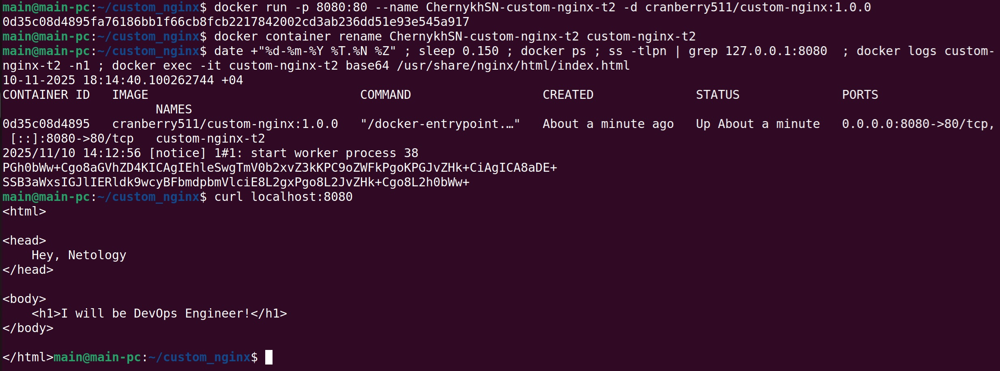

## Решение задачи 3
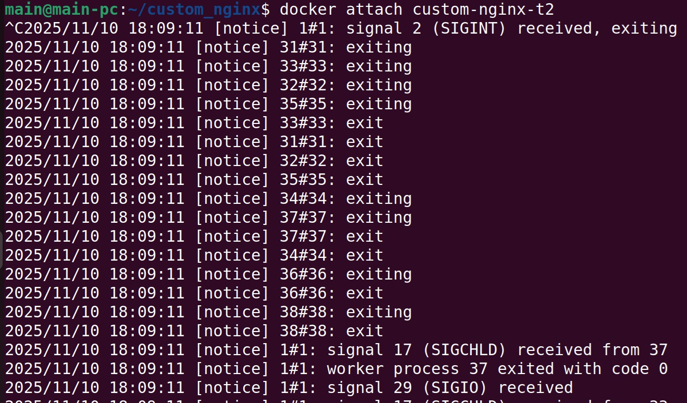

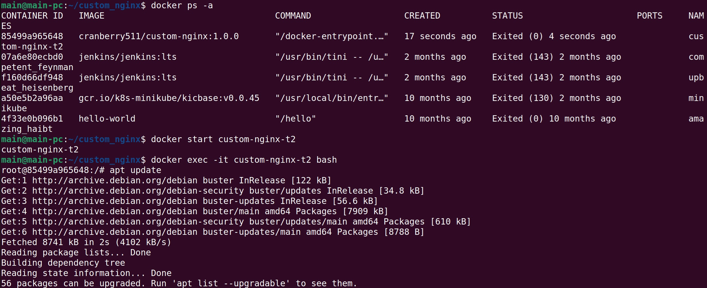

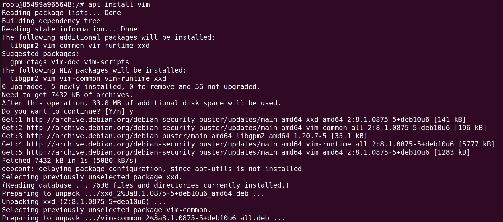

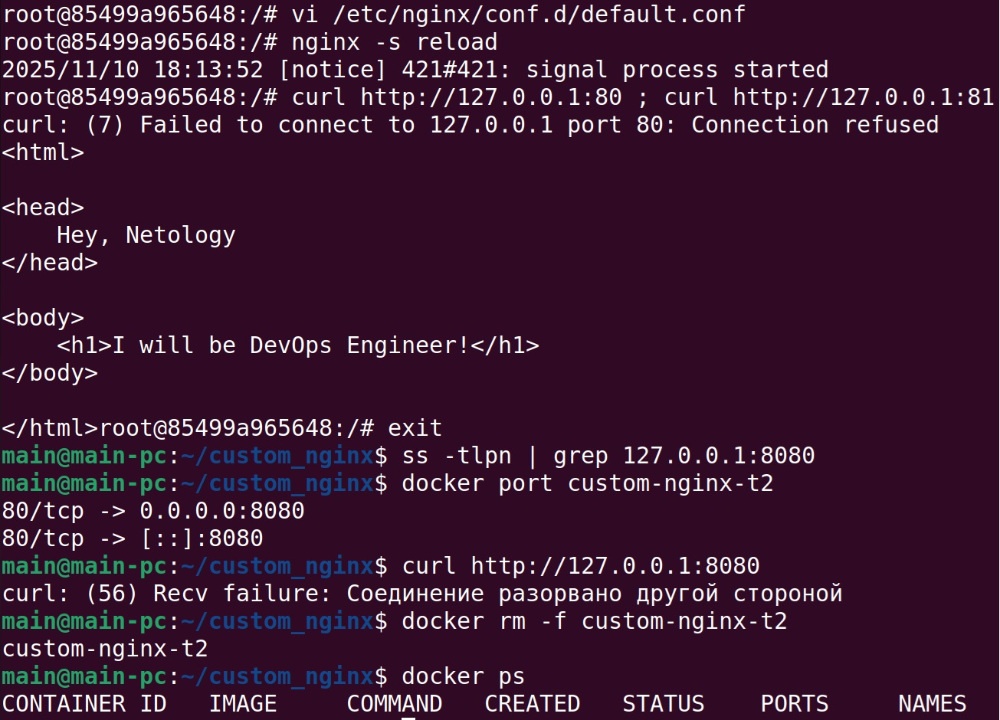

## Решение задачи 4
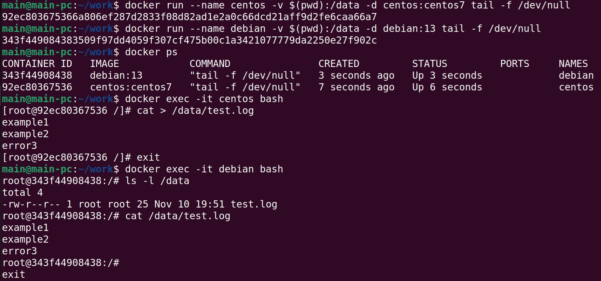

## Решение задачи 5
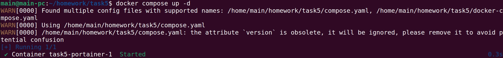

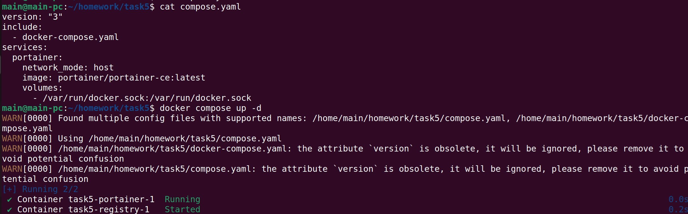

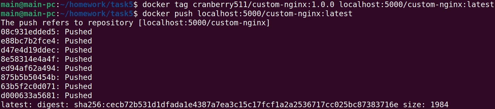

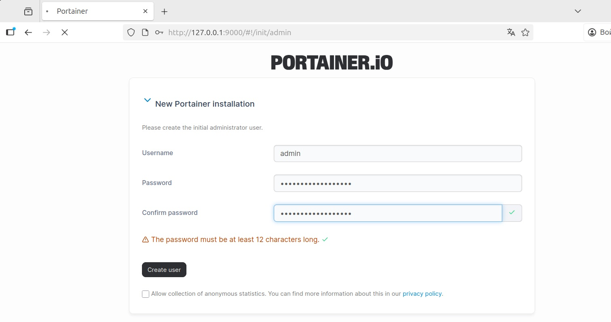

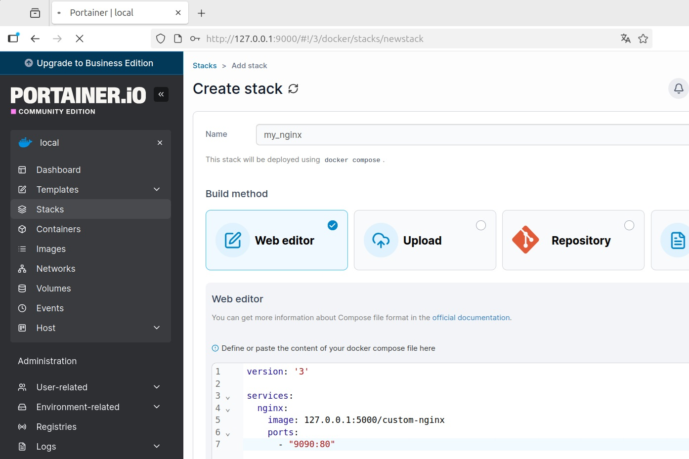

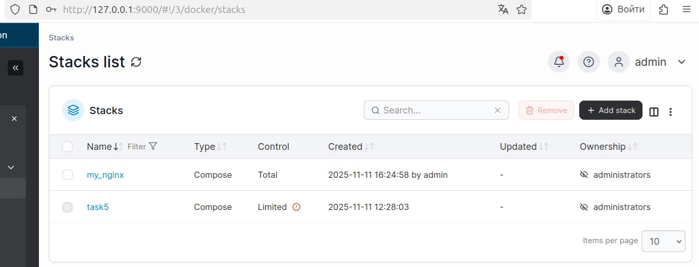

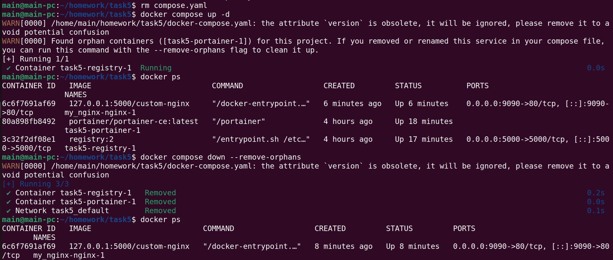

