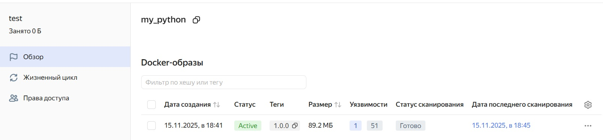
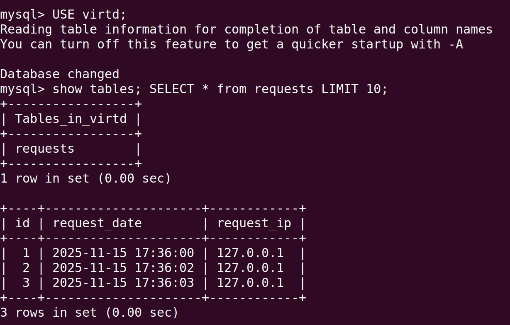
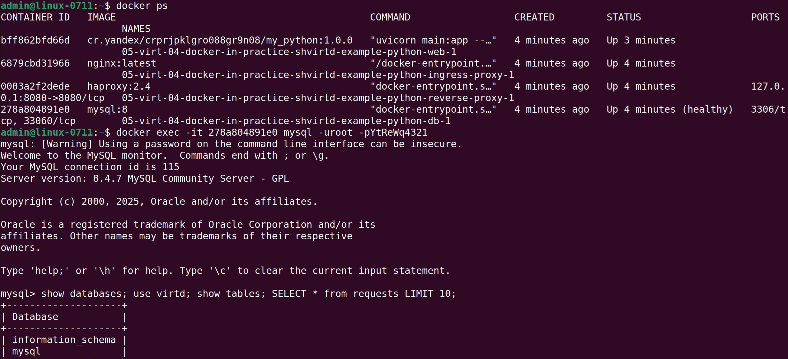
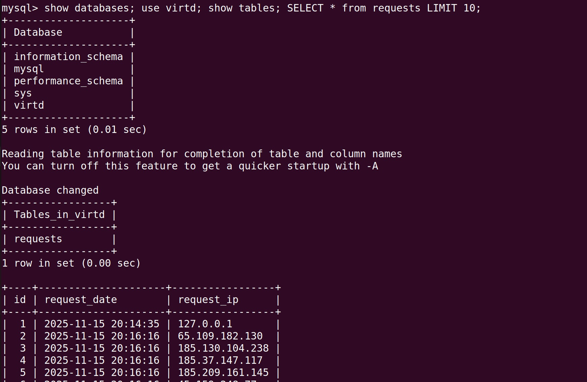
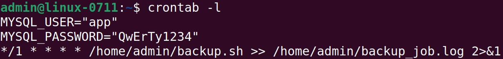
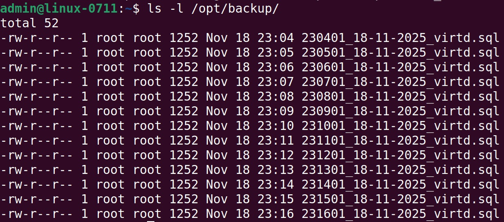
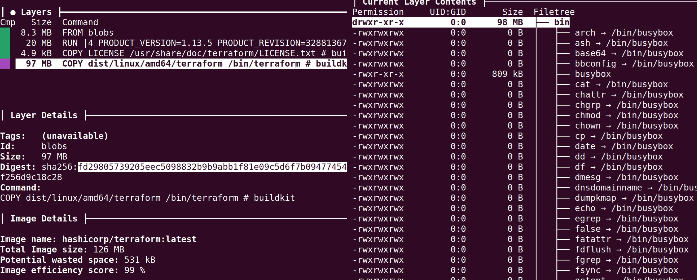
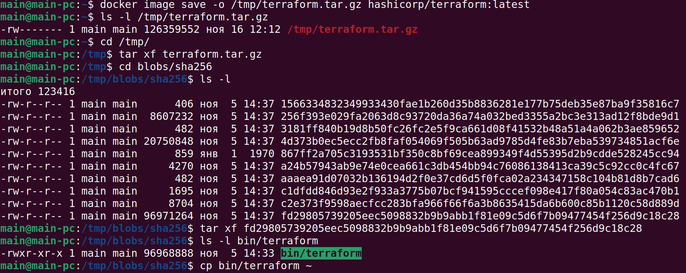
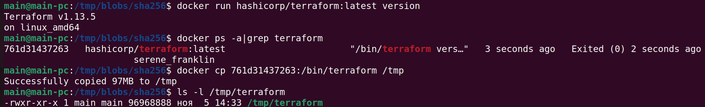
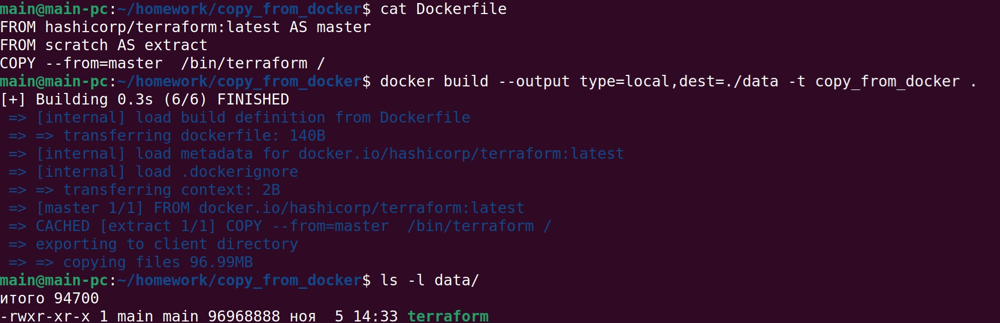

## Решение задачи 1
Ссылка на решение:
https://github.com/cranberry511/05-virt-04-docker-in-practice-shvirtd-example-python

## Решение задачи 2
Отчет сканирования:

## Решение задачи 3
Скриншот sql-запроса:

## Решение задачи 4
Ссылка на fork:
https://github.com/cranberry511/05-virt-04-docker-in-practice-shvirtd-example-python

Скриншот1 sql-запроса:

Скриншот2 sql-запроса:

## Решение задачи 5
Ссылка на скрипт:
https://github.com/cranberry511/05-virt-04-docker-in-practice-shvirtd-example-python/blob/main/backup.sh

Cron-task:

Список резервных копий:

## Решение задачи 6
Копирование бинарного файла:

## Решение задачи 6.1
Копирование бинарного файла, используя docker cp: 

## Решение задачи 6.2
Копирование файла через docker build  

