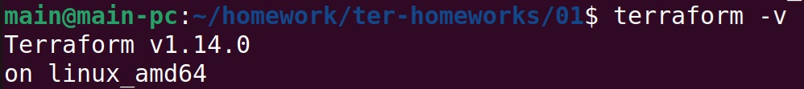
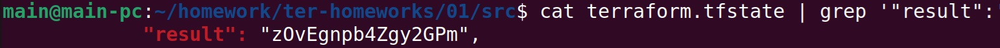
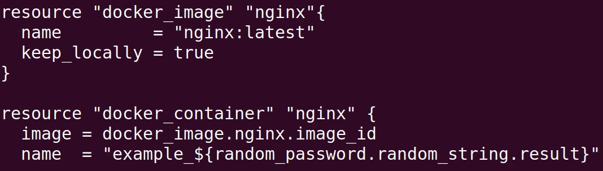
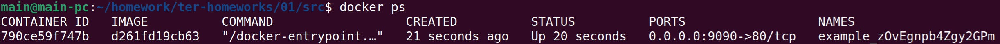
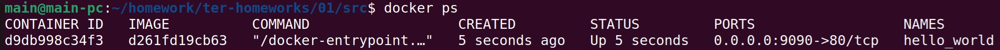
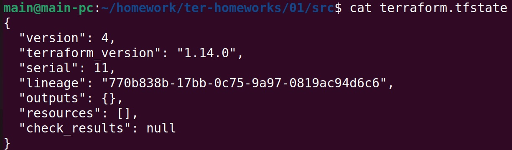
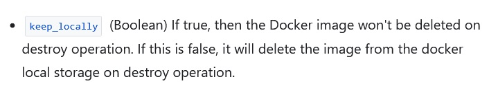
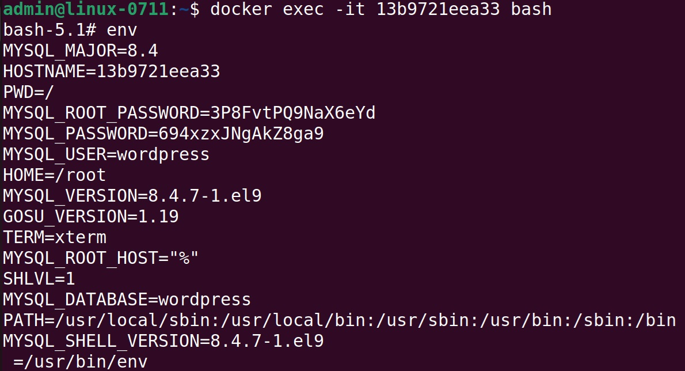
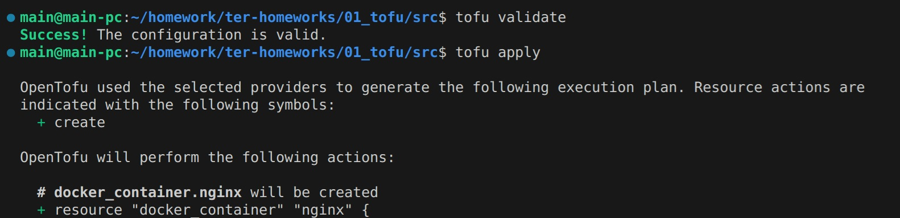
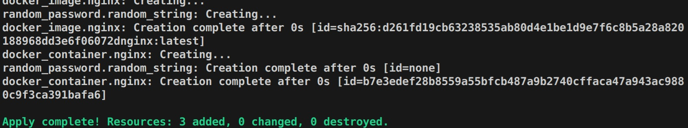

## Чек-лист готовности к домашнему заданию. Скриншот вывода команды ```terraform --version```:



## Решение задания 1
2. Согласно .gitignore, сохранить личную, секретную информацию (логины,пароли,ключи,токены итд) допустимо в:
- \**/.terraform/\* - содержимом каталога .terraform в любом месте репозитория, например .terraform/somefile или somedirectory/.terraform/somefile
- .terraform\* - в любом файл начинающийся с .terraform, кроме .terraformrc из-за пункта !.terraformrc
- \*.tfstate - в любом файле с расширением .tfstate
- \*.tfstate.\* - в любом файлы с дополнительным расширением к .tfstate.
Но поскольку все выше является служебными файлами самого terraform, наиболее реальный вариант - файл personal.auto.tfvars

3. Содержимое ресурса **random_password**:


4. В первом случае пропущено имя ресурса, во втором имя некорректно начинается с цифры, а также присутствует обращение к не существующему ресурсу.

5. Исправленный фрагмент кода:


вывод команды ```docker ps```:


6. Опция -auto-approve используется для применения изменений без необходимости ручного подтверждения пользователем. Необходима там, где требуется автоматизация и невозможна интерактивная работа, например в конвейерах CI/CD.
Отсюда следуют риски применения в системах, требующих высокой доступности - изменения применяются без ручной проверки и подтверждения. Поэтому подобное использование требует предварительной тщательной проверки конфигурации.

Вывод команды ```docker ps```:


8. Содержимое файла **terraform.tfstate**:


9. Docker-образ **nginx:latest** не был удалён из-за параметра keep_locally = true внутри блока docker_image, который позволяет локально сохранять образ при удалении ресурса. Соответствующая строчка из документации:



## Решение задания 2

6. Проверка наличия секретных env-переменных с помощью команды ```env```:


Код в репозитории:
https://github.com/cranberry511/devops_course/blob/main/homework/ter-homeworks/01/main.tf


## Решение задания 3
1. Скорректирвоанные файлы для Opentofu:
https://github.com/cranberry511/devops_course/tree/main/homework/ter-homeworks/01/opentofu
2. Результат выполнения ```tofu apply```:





