## Решение задания 1
5. Ошибки связаны в попыткой использовать некорректные опции для процессора при создания ВМ.
6. Выполнение команды ``` curl ifconfig.me```на удаленной машине:
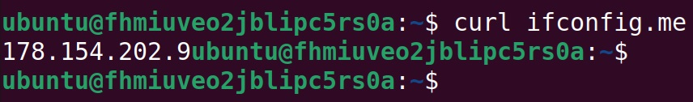

скриншот ЛК Yandex Cloud с созданной ВМ:
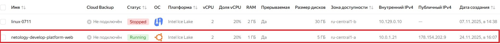

8. Параметры ```preemptible = true``` (Прерываемая ВМ) и ```core_fraction=5``` (гарантированная доля vCPU) позволяют значительно сэкономить при платежах за ВМ, что очень удобно для обучения.


### Решение задания 2
1. Замена всех хардкод-параметров на  переменные:
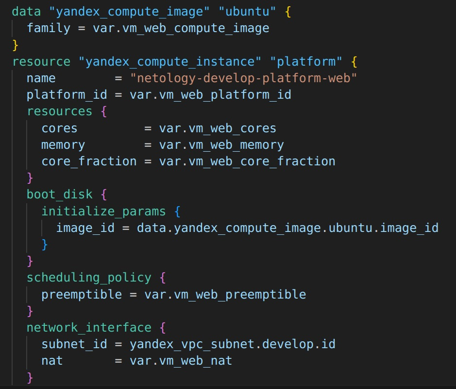

3. Проверка terraform plan:
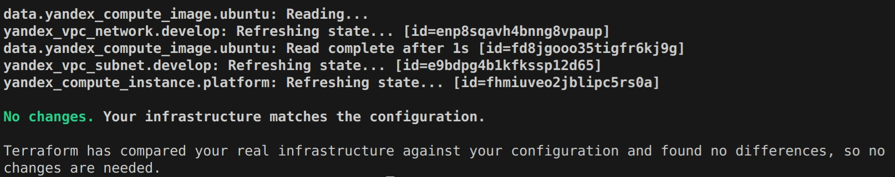


### Решение задания 3
1. Создание файла 'vms_platform.tf':
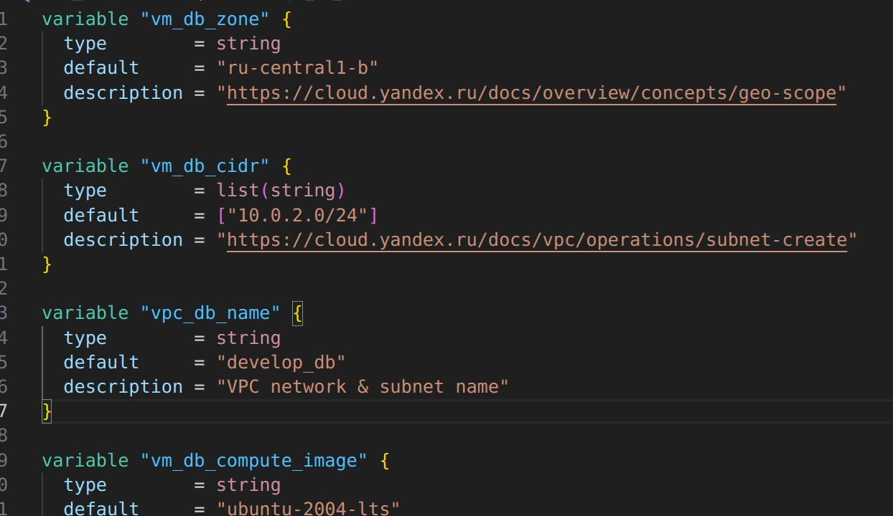


### Решение задания 4
1. Объявление в файле outputs.tf output:
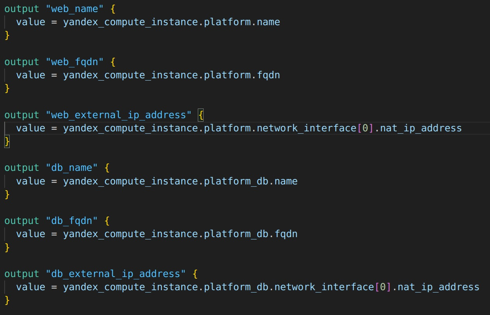

Вывод ```terraform output```:
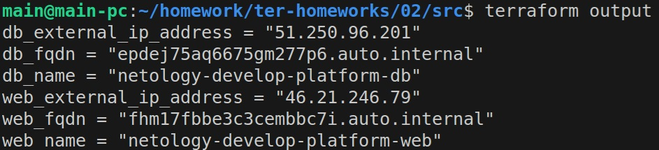

2. Вывод внешних ip-адресов:
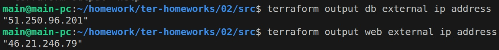


### Решение задания 5
1. Описание имен ВМ в файле locals.tf:
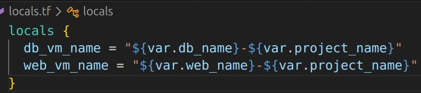


### Решение задания 6
1. Конфиг в виде вложенного map(object):
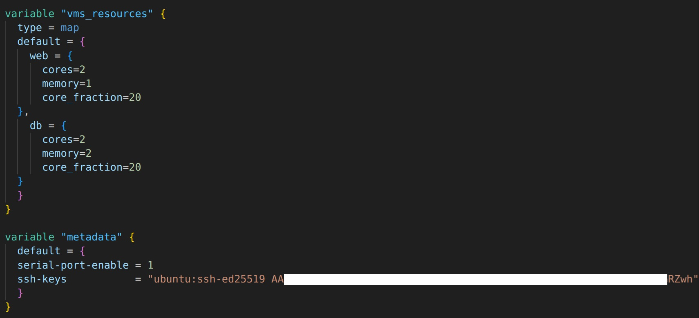


### Решение задания 7
1. Какой командой можно отобразить **второй** элемент списка test_list - local.test_list[1]:
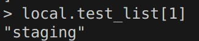

2. Длина списка test_list с помощью функции length(<имя переменной>):
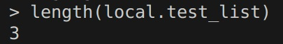

3. Какой командой можно отобразить значение ключа admin из map test_map - local.test_map.admin:
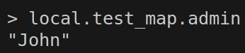

4. Interpolation-выражение:
```"${local.test_map.admin} is ${keys(local.test_map)[0]} for ${keys(local.servers)[1]} server based on OS ${local.servers.production.image} with ${local.servers.production.cpu} vcpu, ${local.servers.production.ram} ram and ${length(local.servers.production.disks)} virtual disks"```
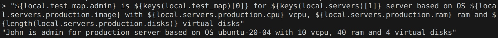


### Решение задания 8
1. Описание переменной test:
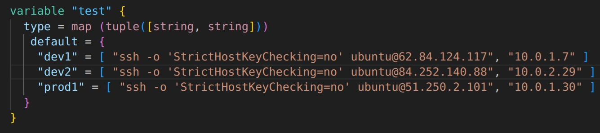

2. Выражение в terraform console, которое позволяет вычленить строку "ssh -o 'StrictHostKeyChecking=no' ubuntu@62.84.124.117" из переменной test:
var.test.dev1[0]
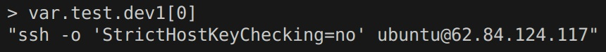


### Решение задания 9
Подключение к ВМ через serial console:
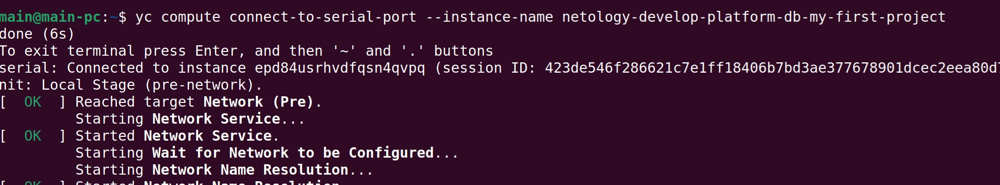

Проверка доступа в интернет с ВМ:
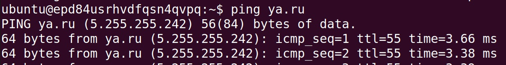
