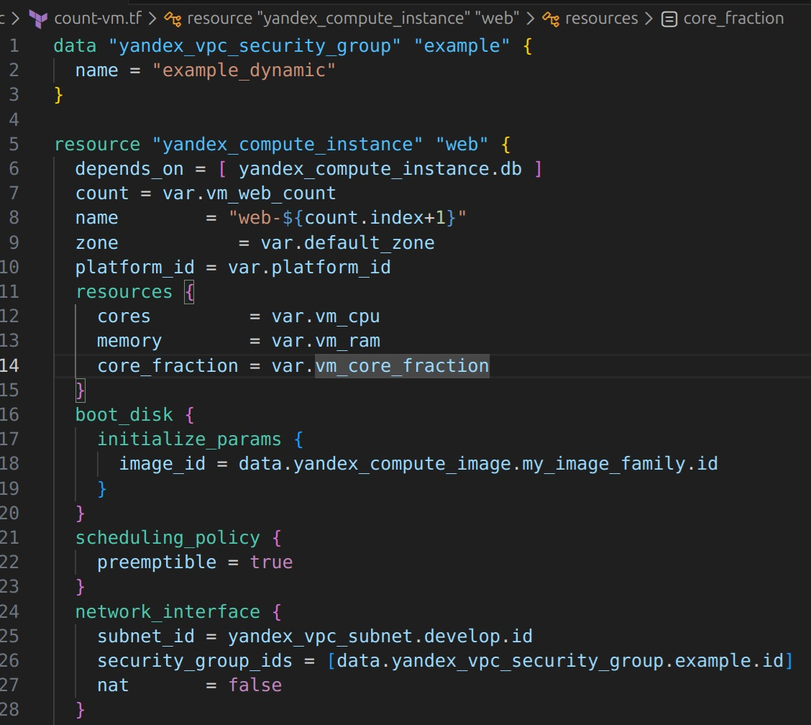
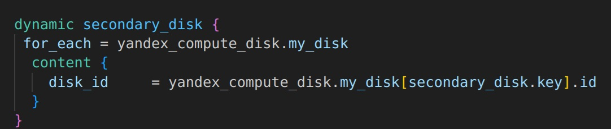
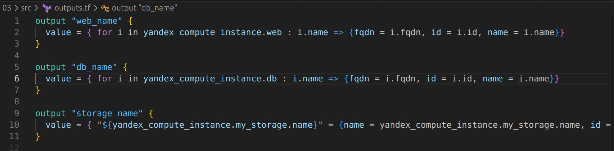
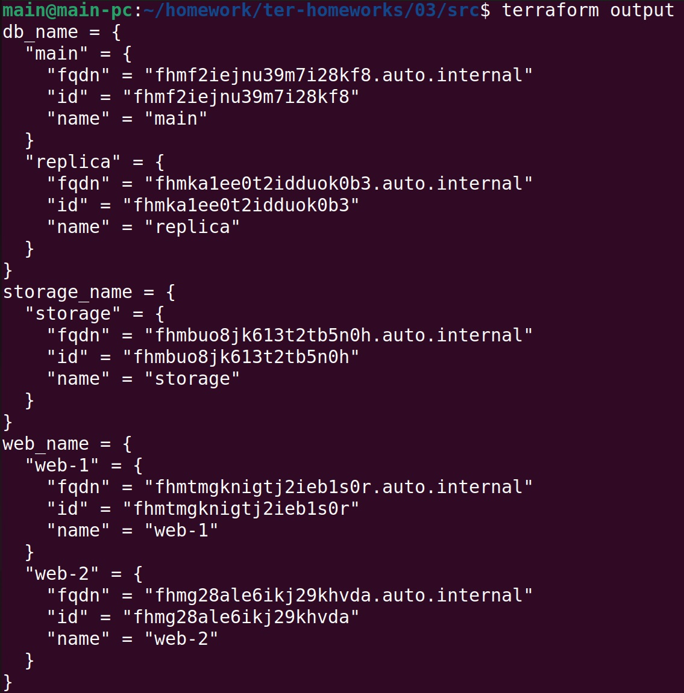
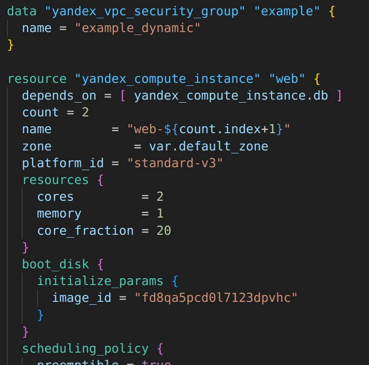
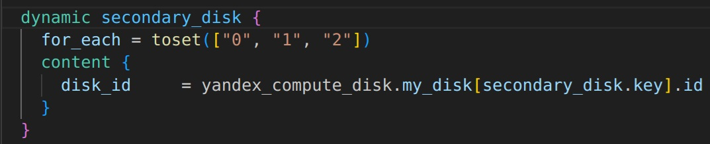
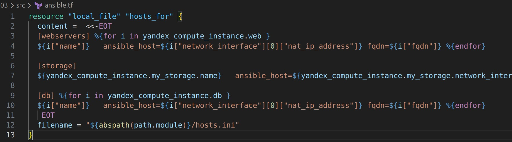
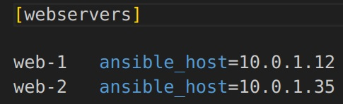
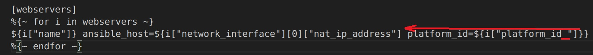
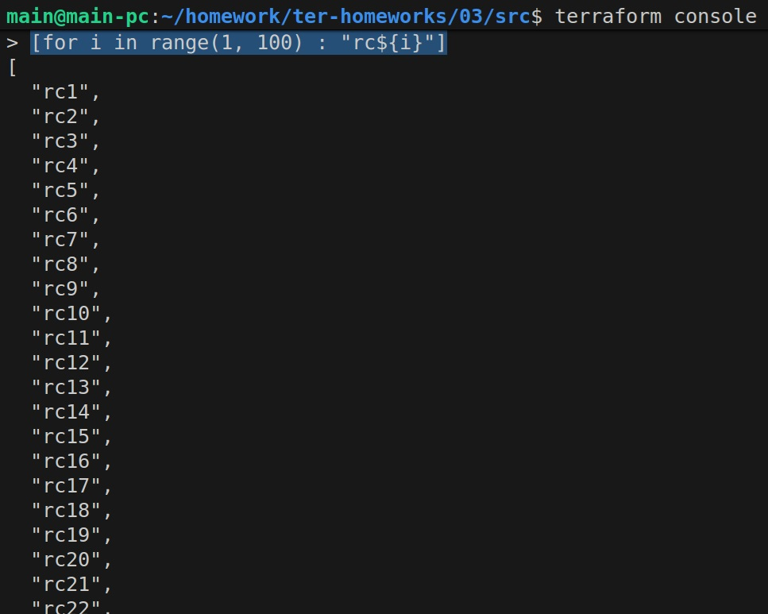

## Дополнение
- Жестко заданные значения параметров изменены на переменные. Теперь код выглядит следующим образом:

- Изменено подключение дополнительных дисков

- Изменен output:


Теперь вывод выглядит следующим образов:


-----------------------------------------------
## Решение задания 1
Cкриншот входящих правил «Группы безопасности» в ЛК Yandex Cloud:


## Решение задания 2
1. Файл count-vm.tf:


2. Файл for_each-vm.tf:
 


## Решение задания 3
1. Создание 3 одинаковых виртуальных диска размером 1 Гб в файле **disk_vm.tf** :
 

2. Создание ВМ c именем "storage" и подключение дисков:
 


## Решение задания 4
1. Файл ansible.tf:


Файл inventory:


## Решение задания 5
1. Output, который отображает ВМ в виде списка словарей:


Вывод команды ```terrafrom output```:


## Решение задания 6
3.Файл-шаблон hosts6.tftpl:


Результат:


https://github.com/cranberry511/devops_course/blob/main/homework/ter-homeworks/03/src/hosts6.tftpl
https://github.com/cranberry511/devops_course/blob/main/homework/ter-homeworks/03/src/inventory6.tf

## Решение задания 7
Выражение в terraform console, которое удаляет 3 элемент:
```
{"network_id" = "enp7i560tb28nageq0cc", subnet_ids = [for index, id in local.vpc.subnet_ids : id if index != 2], subnet_zones  = [for index, zone in local.vpc.subnet_zones : zone if index != 2]}
```

Результат:


## Решение задания 8
Ошибка заключается в некорректно расположении фигурных скобок, закрывающих вывод для переменной ansible_host, а также в лишнем пробеле для "platform_id ":


Правильный вариант:


## Решение задания 9
1. ```[for i in range(1, 100) : "rc${i}"]```


2. ```[for i in range(1, 97) :  "rc${i}" if i == 19 || !contains(["0","7","8","9"], substr(i, -1, 1))]```
