## Решение задания 1

1. Создание 2 ВМ:
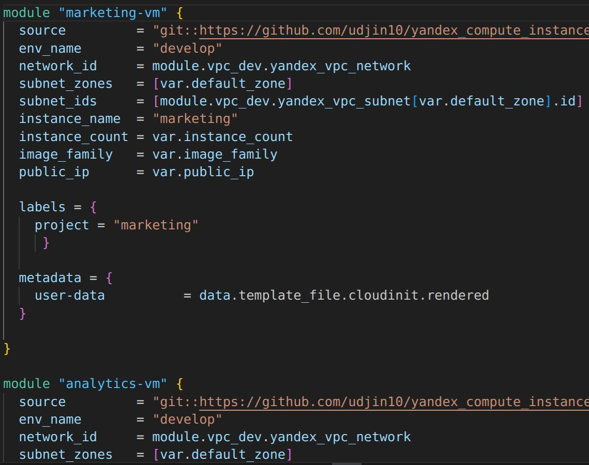

3. Добавление в файл cloud-init.yml установку nginx.
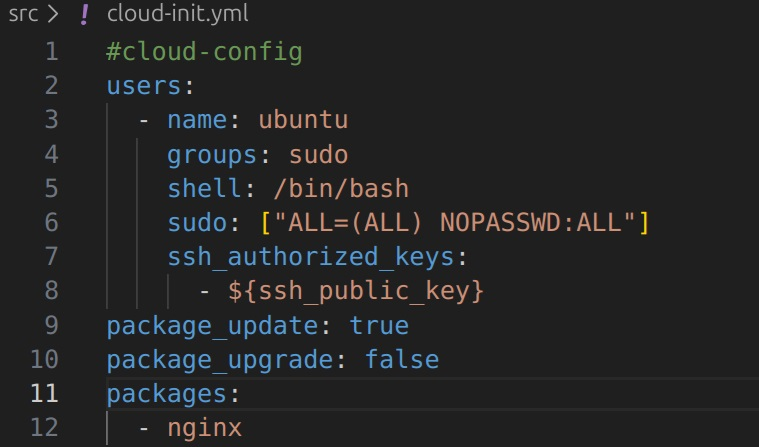

4. Подключения к консоли:
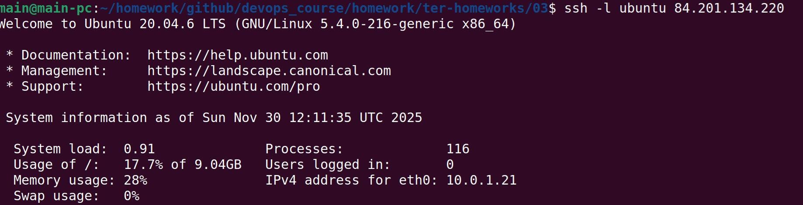

Вывод команды ```sudo nginx -t```:
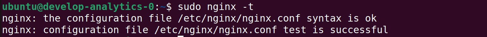

Cкриншот консоли ВМ yandex cloud:


Скриншот содержимого модуля:
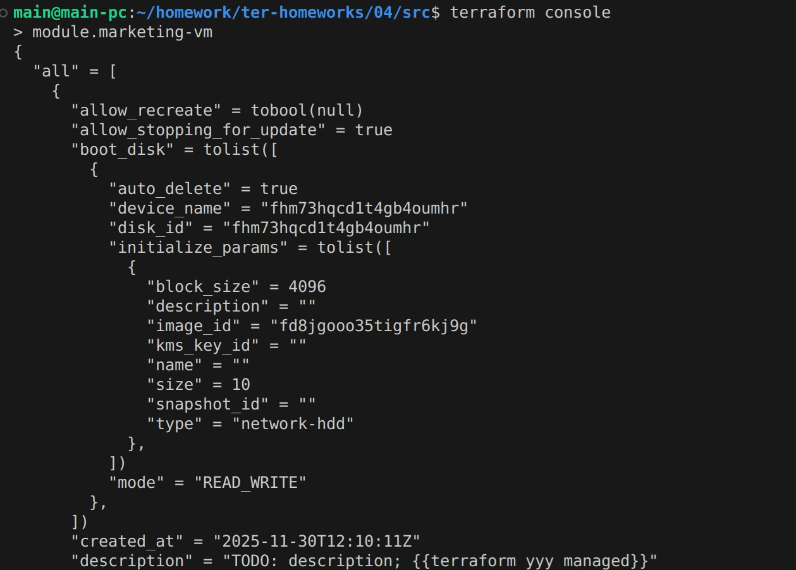


## Решение задания 2
3. Скриншот информации о модуле vpc_dev:
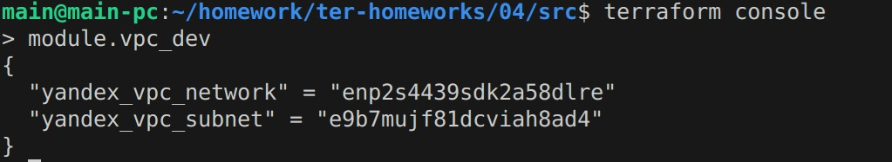
5. Документацию к модулю:
```docker run --rm --volume "$(pwd):/terraform-docs" -u $(id -u) quay.io/terraform-docs/terraform-docs:0.16.0 markdown /terraform-docs```
https://github.com/cranberry511/devops_course/blob/main/homework/ter-homeworks/04/src/docs.md
 
## Решение задания 3
1. Вывести список ресурсов в стейте:
```terraform state list```
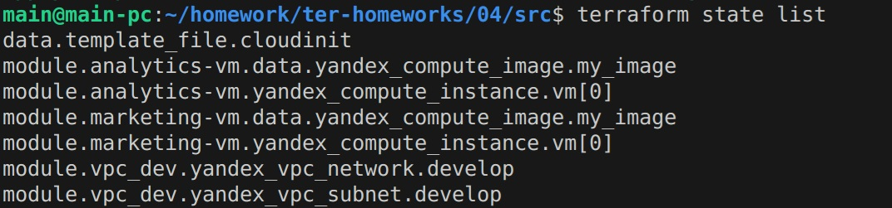

2-4. Список команд:
terraform state rm module.vpc_dev.yandex_vpc_network.develop
terraform state rm module.vpc_dev.yandex_vpc_subnet.develop
terraform state rm module.analytics-vm.yandex_compute_instance.vm[0]
terraform state rm module.marketing-vm.yandex_compute_instance.vm[0]
terraform import  module.marketing-vm.yandex_compute_instance.vm[0] fhmrd3utk7vu92pfa8a3
terraform import  module.analytics-vm.yandex_compute_instance.vm[0] fhmi5jen4f96ue9cmfmu
terraform import module.vpc_dev.yandex_vpc_network.develop enpsgvmucertf5ef99nv
terraform import module.vpc_dev.yandex_vpc_subnet.develop e9b28hvu0bogeg76qvql

Скриншоты шагов:
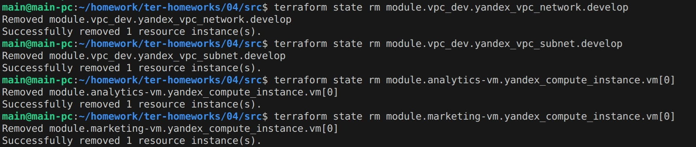

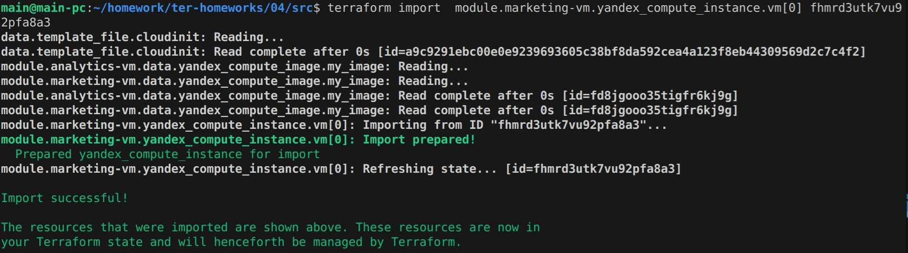

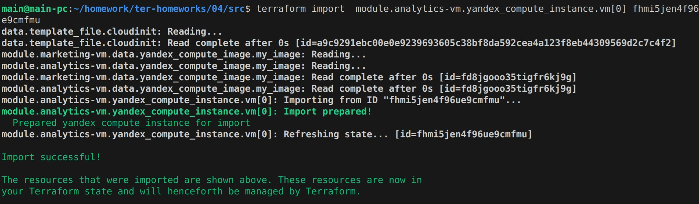

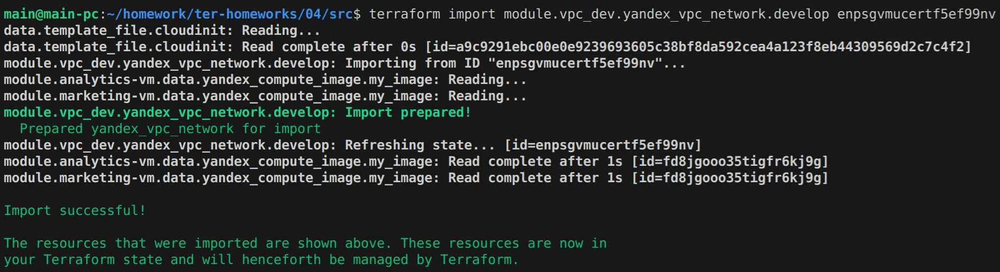

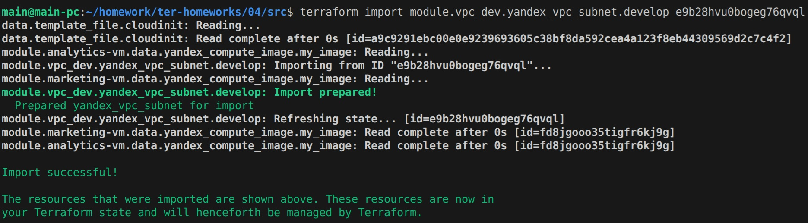

Скриншот terraform plan:
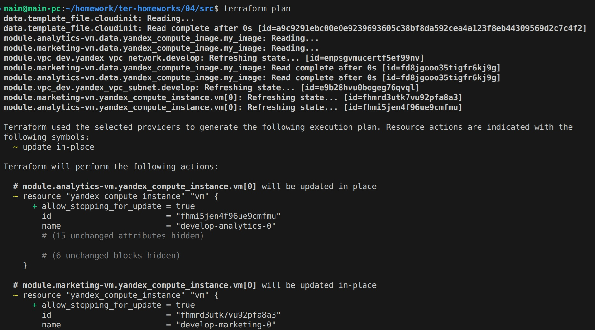


## Решение задания 4

1. Код измененного модуля vpc:
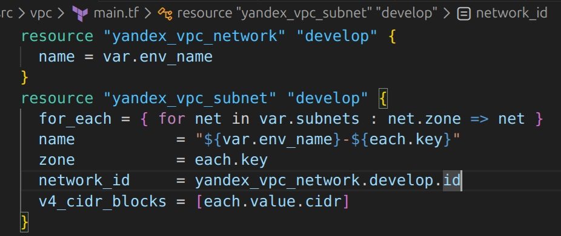

Результат выполнения:
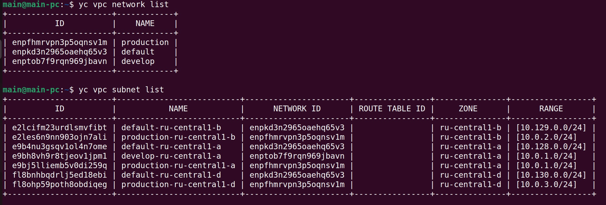

## Решение задания 5

1. Модуль для создания кластера БД Mysql:
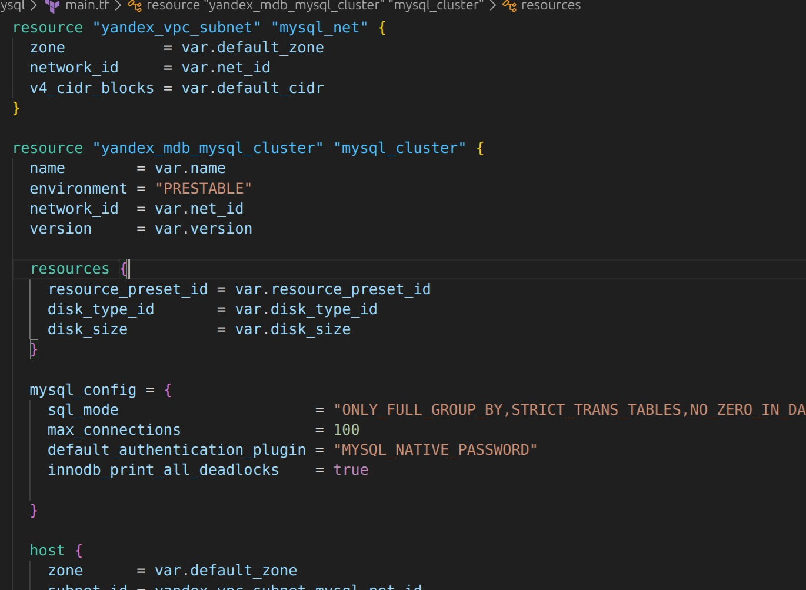

2. Модуль создания базы данных и пользователя:
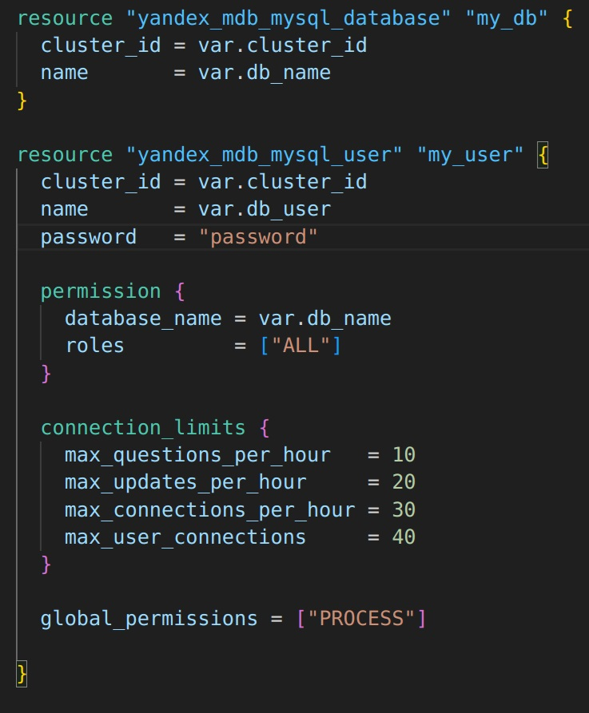

Вызов модуля по созданию базы данных и пользователя:
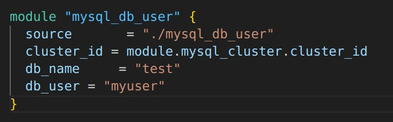

3. Создание кластера example из одном хосте:
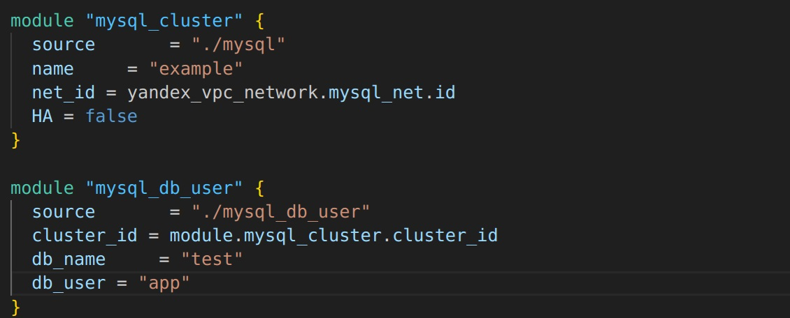

Результат создания БД test и пользователя app::
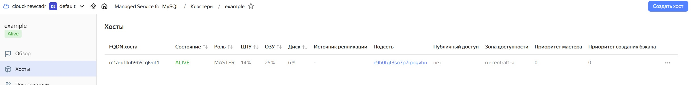


Перевод сингл хоста в кластер из 2-х серверов:


Процесс обновления кластера:
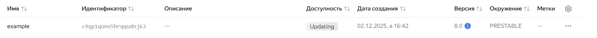

Результат:
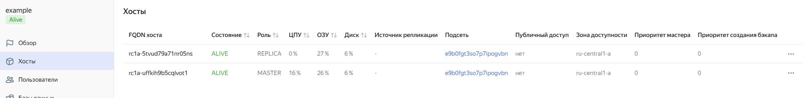


## Решение задания 6
1. Код создания s3 бакета размером 1 ГБ:
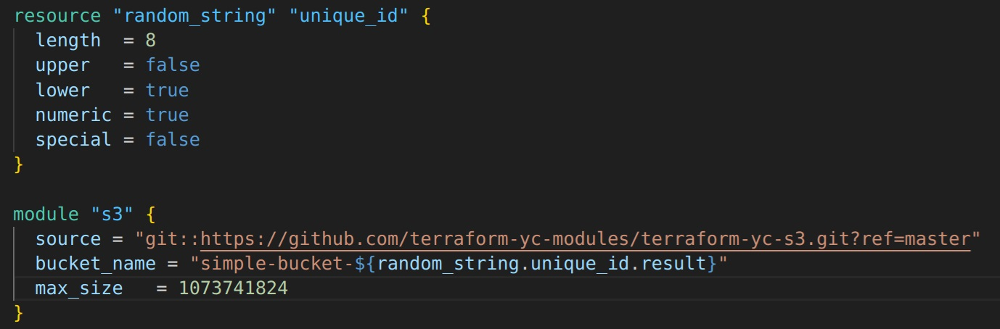

Результат:
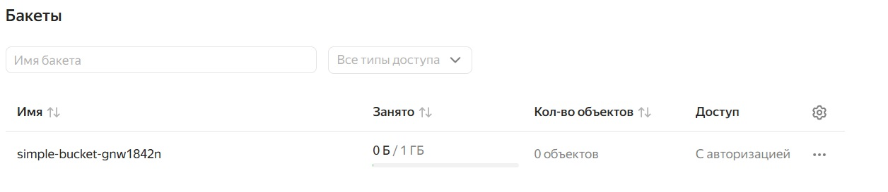

## Решение задания 7
2. Вход в web-интерфейс:
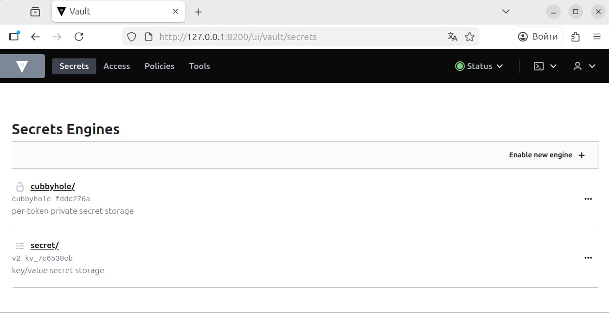

3. Создание нового секрета:
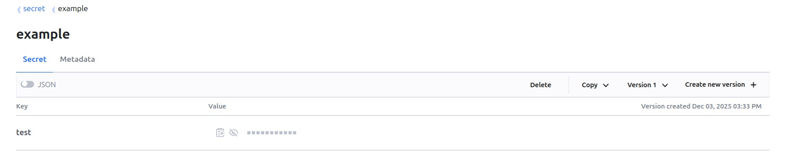
 
4. Считывание секрета с помощью terraform:
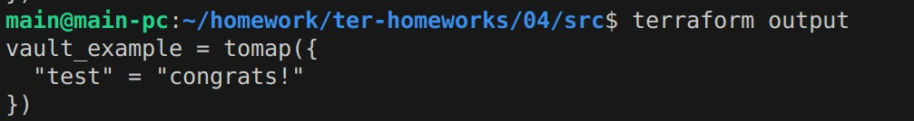

5. Запись нового секрета в vault:
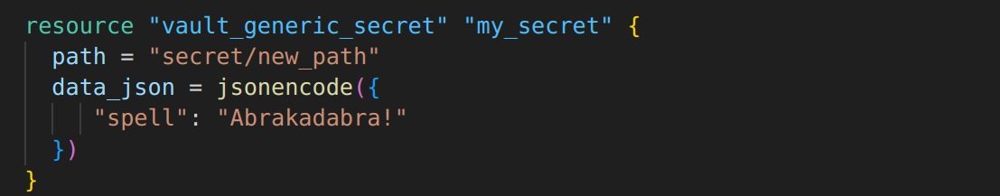

Результат:
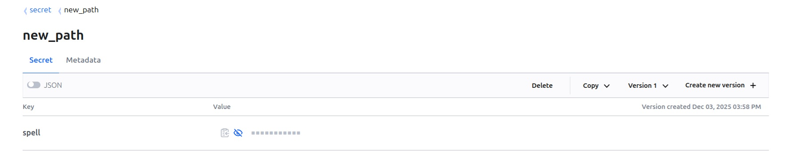

## Решение задания 8
Разделение на два отдельных root-модуля: создание VPC , создание ВМ, ссылки на соответствующие root-модули:
https://github.com/cranberry511/devops_course/tree/main/homework/ter-homeworks/04/vpc
https://github.com/cranberry511/devops_course/tree/main/homework/ter-homeworks/04/vm


